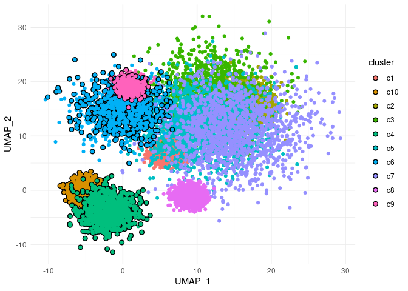

<!-- README.md is generated from README.Rmd. Please edit that file -->

# ggtrace

<!-- badges: start -->

[](https://github.com/rnabioco/ggtrace/actions)
[](https://codecov.io/gh/rnabioco/ggtrace?branch=master)
<!-- badges: end -->

## Overview

A scatter plot is a common way to compare two continuous variables.
However, when there are thousands of data points, it can be difficult to
distinguish between groups based on color alone. ggtrace provides
ggplot2 geoms that highlight groups of data points with an outline for
emphasis.

### Installation

You can install the development version of ggtrace from
[GitHub](https://github.com/rnabioco/ggtrace) with:

``` r
# install.packages("devtools")
devtools::install_github("rnabioco/ggtrace")
```

<br>

## Basic Usage

`geom_point_trace` accepts graphical parameters normally passed to
`geom_point` to control the appearance of data points. The appearance of
the group outline can be controlled using the following additional
parameters, `trace_color`, `trace_size`, `trace_linetype`, and
`trace_alpha`.

``` r
library(ggplot2)
library(ggtrace)

p <- ggplot(
  clusters,
  aes(UMAP_1, UMAP_2, color = cluster)
) + 
  theme_minimal()

p +
  geom_point_trace(
    trace_color    = "black",
    trace_size     = 1,
    trace_linetype = 1,
    trace_alpha    = 1
  )
```


<br>

## Aesthetics

Like other `ggplot2` geoms, variables can be mapped to the new aesthetic
attributes.

``` r
ggplot(
  clusters,
  aes(UMAP_1, UMAP_2, trace_color = cluster)
) +
  theme_minimal() +
  geom_point_trace(
    trace_size = 2
  )
```


By specifying `group` within `aes()`, outlines can also be added when
coloring with a continuous variable.

``` r
p <- ggplot(
  clusters,
  aes(UMAP_1, UMAP_2, color = signal, group = cluster)
) +
  theme_minimal()

p +
  scale_color_gradient(low = "white", high = "red") +
  geom_point_trace(
    trace_size = 0.5
  )
```


A set of `scale_trace_*` functions allows additional control of outline
aesthetics.

``` r
p <- ggplot(
  clusters,
  aes(UMAP_1, UMAP_2, trace_color = sample)
) +
  theme_minimal()

p +
  geom_point_trace(
    color      = "white",
    trace_size = 2
  ) +
  scale_trace_color_manual(
    values = c("red", "#0072B2")
  )
```


<br>

## Position

The ‘position’ of the outline can be modified with the
`outline_position` parameter. This can be ‘all’, ‘bottom’, or a
predicate selecting the points to outline. By default ‘all’ groups are
outlined.

To only add a single outline around all points plotted, set
`trace_position` to ‘bottom’.

``` r
p <- ggplot(
  clusters,
  aes(UMAP_1, UMAP_2, color = cluster)
) +
  theme_minimal()

p +
  geom_point_trace(
    trace_position = "bottom"
  )
```


A subset of data points can be highlighted by passing a predicate to
`outline_position`. This must evaluate to `TRUE` or `FALSE` within the
context of the input data.

``` r
p +
  geom_point_trace(
    trace_position = signal < 0
  )
```


