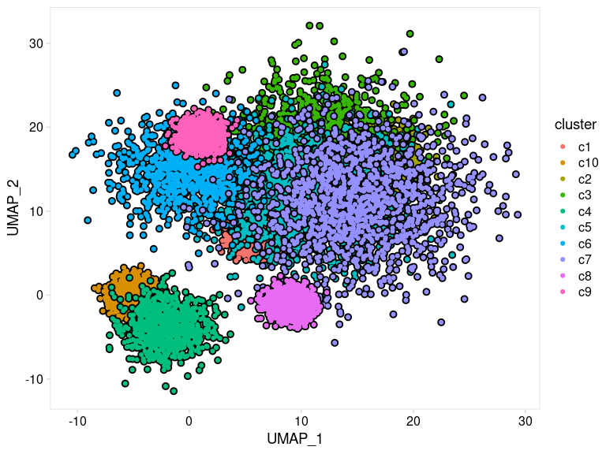
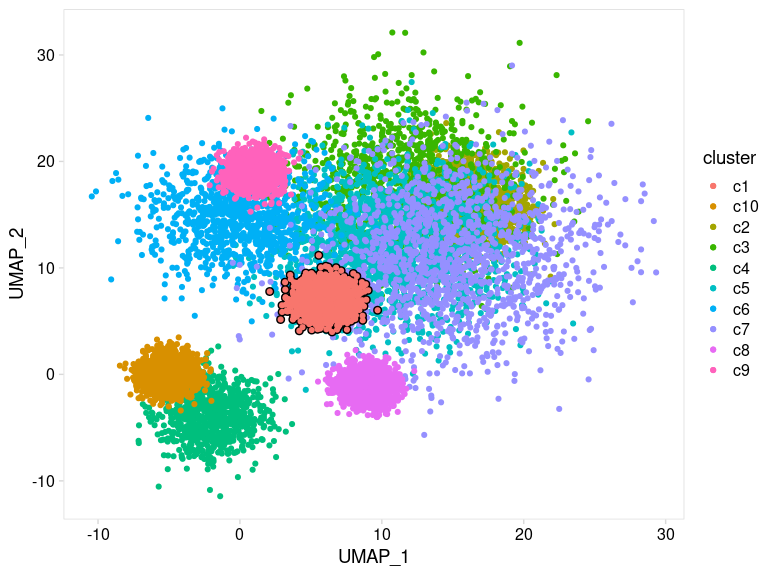

<!-- README.md is generated from README.Rmd. Please edit that file -->

# ggtrace

<!-- badges: start -->

[](https://github.com/rnabioco/ggtrace/actions/workflows/R-CMD-check.yaml)
[](https://app.codecov.io/gh/rnabioco/ggtrace?branch=master)
<!-- badges: end -->

ggtrace provides ggplot2 geoms that allow groups of data points to be
outlined or highlighted for emphasis. This is particularly useful when
working with dense datasets that are prone to overplotting.

<br>

## Installation

You can install the released version from CRAN:

``` r
install.packages("ggtrace")
```

and the development version from
[GitHub](https://github.com/rnabioco/ggtrace):

``` r
devtools::install_github("rnabioco/ggtrace")
```

<br>

## Basic Usage

`geom_point_trace()` accepts graphical parameters normally passed to
`ggplot2::geom_point()` to control the appearance of data points and
outlines. The `trace_position` argument can be used to select specific
sets of points to highlight. For more examples see the
[vignette](https://rnabioco.github.io/ggtrace/articles/geom-point-trace.html).

``` r
library(ggplot2)
library(ggtrace)

ggplot(clusters, aes(UMAP_1, UMAP_2, color = cluster)) +
  geom_point_trace(
    trace_position    = signal < 0,
    fill              = "white",
    background_params = list(color = NA, fill = "grey85")
  ) +
  theme_minimal()
```



<br>

`geom_line_trace()` accepts parameters normally passed to
`ggplot2::geom_line()` with the following exceptions: `fill` controls
the inner line color, `color` controls the outline color, and `stroke`
controls outline width. Like `geom_point_trace()`, the `trace_position`
argument can be used to select specific data points to highlight. For
more examples see the
[vignette](https://rnabioco.github.io/ggtrace/articles/geom-line-trace.html).

``` r
ggplot(stocks, aes(day, value, color = name)) +
  geom_line_trace(
    trace_position    = day < 500 | day > 1500,
    stroke            = 1,
    background_params = list(color = NA, fill = "grey75")
  ) +
  theme_minimal()
```


