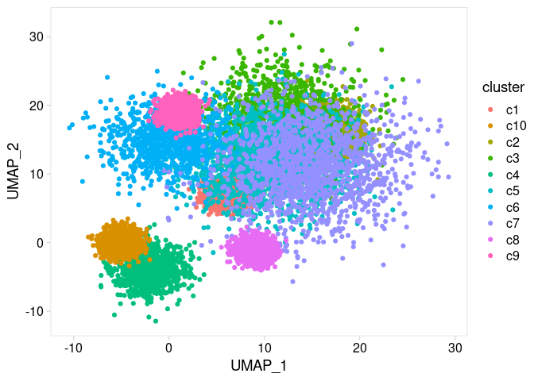

<!-- README.md is generated from README.Rmd. Please edit that file -->

# ggoutline

<!-- badges: start -->

[](https://codecov.io/gh/rnabioco/ggoutline?branch=master)
<!-- badges: end -->

ggoutline allows users to outline groups of data points using ggplot2.

## Installation

You can install the development version of ggoutline from
[GitHub](https://github.com/rnabioco/ggoutline) with:

``` r
# install.packages("devtools")
devtools::install_github("rnabioco/ggoutline")
```

## Why use ggoutline?

A scatter plot is a common way to compare two continuous variables.
However, when there are thousands of data points, it can be difficult
distinguish between groups based on color alone. With ggoutline groups
of points can be highlighted.

``` r
library(ggoutline)
library(cowplot)
library(purrr)
library(ggplot2)
library(dplyr)
#> 
#> Attaching package: 'dplyr'
#> The following objects are masked from 'package:stats':
#> 
#>     filter, lag
#> The following objects are masked from 'package:base':
#> 
#>     intersect, setdiff, setequal, union

th <- theme_cowplot() +
  theme(
    axis.line    = element_blank(),
    panel.border = element_rect(fill = NA, color = "grey85"),
    axis.ticks   = element_line(color = "grey85")
  )

p <- clusters %>%
  ggplot(aes(UMAP_1, UMAP_2, color = cluster)) +
  th

p +
  geom_point()
```



<br>

geom\_outline will add outlines around each group

``` r
p +
  geom_outline(
    outline_size     = 2.5,
    outline_position = "all"
  )
```


<br>

To outline all points together regardless of color or group, set
outline\_position to ‘bottom’

``` r
p +
  geom_outline(
    outline_size     = 2.5,
    outline_position = "bottom"
  )
```


<br>

By passing a group name (or vector of names) to outline\_position, a
sinlge cluster can be highlighted

``` r
p +
  geom_outline(
    outline_size     = 2.5,
    outline_position = "c1"
  )
```


<br>

By specifying `group` within `aes()`, outlines can be added when
coloring with a continuous variable

``` r
p <- clusters %>%
  ggplot(aes(UMAP_1, UMAP_2, color = signal, group = cluster)) +
  scale_color_gradientn(colors = c("white", "red")) +
  th

p +
  geom_outline(
    outline_size     = 2.5,
    outline_position = c("c1", "c2")
  )
```


