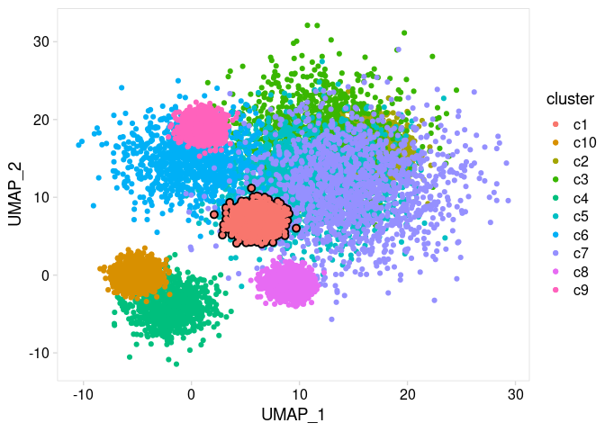
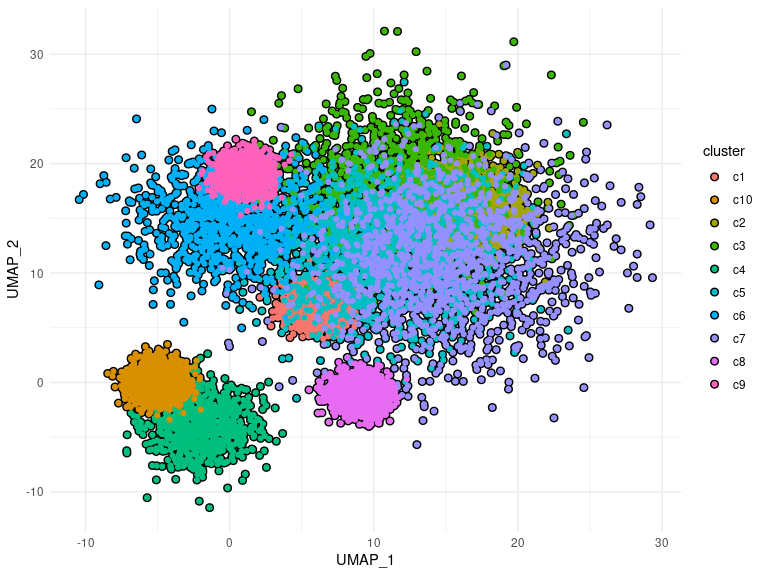

<!-- README.md is generated from README.Rmd. Please edit that file -->

# ggoutline

<!-- badges: start -->

[](https://codecov.io/gh/rnabioco/ggoutline?branch=master)
<!-- badges: end -->

## Installation

You can install the development version of ggoutline from
[GitHub](https://github.com/rnabioco/ggoutline) with:

``` r
# install.packages("devtools")
devtools::install_github("rnabioco/ggoutline")
```

<br>

## Rationale

A scatter plot is a common way to compare two continuous variables.
However, when there are thousands of data points, it can be difficult to
distinguish between groups based on color alone. This is a first attempt
at a package that allows groups of data points (or lines or bars) to be
highlighted using ggplot2. This is under development and likely contains
numerous bugs.

geom\_outline will outline each group plotted

``` r
library(ggoutline)
library(tidyverse)
library(lubridate)
library(cowplot)

th <- theme_cowplot() +
  theme(
    axis.line    = element_blank(),
    panel.border = element_rect(fill = NA, color = "grey85"),
    axis.ticks   = element_line(color = "grey85")
  )

p <- clusters %>%
  ggplot(aes(UMAP_1, UMAP_2, color = cluster)) +
  th

p +
  geom_outline(
    outline_size     = 2.5,
    outline_position = "all"
  )
```


<br>

By passing a group name (or vector of names) to outline\_position, a
single cluster can be highlighted

``` r
p +
  geom_outline(
    outline_size     = 2.5,
    outline_position = "c1"
  )
```


<br>

By specifying `group` within `aes()`, outlines can be added when
coloring with a continuous variable

``` r
p <- clusters %>%
  ggplot(aes(UMAP_1, UMAP_2, color = signal, group = cluster)) +
  scale_color_gradientn(colors = c("white", "red")) +
  th

p +
  geom_outline(
    outline_size     = 2.5,
    outline_position = c("c1", "c2")
  )
```



<br>

geom\_outline is also compatible with other geoms including `line`…

``` r
dat <- world_bank_pop %>%
  na.omit() %>%
  filter(indicator == "SP.POP.TOTL") %>%
  pivot_longer(matches("[0-9]+"), names_to = "yr", values_to = "population") %>%
  mutate(yr = as_date(str_c(yr, "-1-1")))

p <- dat %>%  
  ggplot(aes(yr, population, group = country)) +
  th +
  theme(legend.position = "none")

p +
  geom_outline(
    geom             = "line",
    outline_size     = 2.5,
    outline_color    = "red",
    outline_position = c("LMY", "CHN"),
    color            = "grey70"
  )
```


<br>

…and `bar`

``` r
dat %>%
  filter(year(yr) == 2000) %>%
  
  ggplot(aes(population)) +
  geom_outline(
    geom         = "bar",
    stat         = "bin",
    outline_size = 2.5,
    fill         = "#56B4E9"
  ) +
  scale_x_log10() +
  th
```


